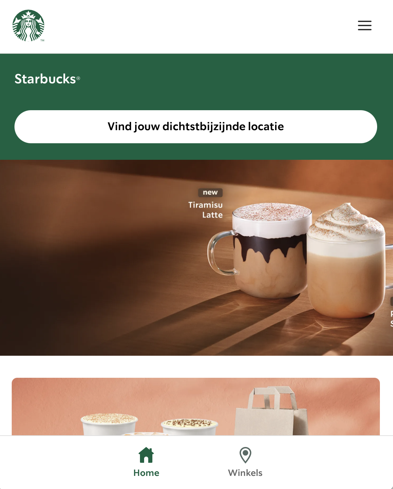
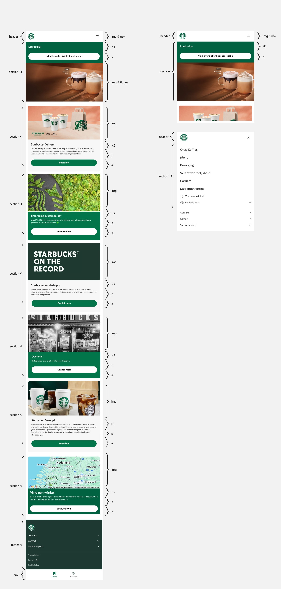

# Procesverslag
Markdown is een simpele manier om HTML te schrijven.  
Markdown cheat cheet: [Hulp bij het schrijven van Markdown](https://github.com/adam-p/markdown-here/wiki/Markdown-Cheatsheet).

Nb. De standaardstructuur en de spartaanse opmaak van de README.md zijn helemaal prima. Het gaat om de inhoud van je procesverslag. Besteedt de tijd voor pracht en praal aan je website.

Nb. Door *open* toe te voegen aan een *details* element kun je deze standaard open zetten. Fijn om dat steeds voor de relevante stuk(ken) te doen.

## Jij

  
uitwerken voor kick-off werkgroep

  ### Auteur:
  Serra Dekker

  #### Je startniveau:
  Blauw

  #### Je focus:
  Responsive
 

## Je website

  
uitwerken voor kick-off werkgroep

  ### Je opdracht:
  https://www.starbucks.nl 
  #### Screenshot(s) van de eerste pagina (small screen): 
Homepage
  

  #### Screenshot(s) van de tweede pagina (small screen):
  hier de naam van de pagina  
  
 

## Toegankelijkheidstest 1/2 (week 1)

  
uitwerken na test in 2e werkgroep

  ### Bevindingen
  Lijst met je bevindingen die in de test naar voren kwamen:
  - De pagina is goed te gebruiken met een screen reader.
  - Weinig tot geen H1 te vinden
  - Geen ondertitelingen/videos

## Breakdownschets (week 1)

  
uitwerken na afloop 3e werkgroep

  ### de hele pagina: 
  

  ### dynamisch deel (bijv menu): 
  

## Voortgang 1 (week 2)

  
uitwerken voor 1e voortgang

  ### Stand van zaken
  hier dit ging goed & dit was lastig (neem ook screenshots op van delen van je website en code)
  Ik heb een begin gemaakt aan de website. Dit vind ik altijd lastig dus gebruik ik soms een deel van een andere website die ik al eerder heb gemaakt op een klein begin te hebben. Verder gaat het wel oke.

  Gebruikte bronnen:
  https://www.w3schools.com/tags/tag_figure.asp

  ### Agenda voor meeting
  samen met je groepje opstellen

  | Serra          | Geis               | Vince       | june        |
  | ---            | ---                | ---          | ---              |
  | dit bespreken  | en dit             | en ik dit    | en dan ik dat    |
  | en dat ook nog | dit als er tijd is | nog een punt | dit wil ik zeker |
  | ...            | ...                | ...          | ...              |

Serra : Ik wil graag de opbouw van mijn HTML bespreken en kijken of er nog dingen niet goed zijn. Ook heb ik denk ik hulp nodig met het uitlijnen van de elementen door middel van een grid.
-Groene lijn onder de eerste section gaat niet weg.
-Deel van de padding weghalen lukt niet

Geis: Css bespreken en kijken welke elementen in een Ul horen.

Vince: M'n navigatie perfect namaken en weten welke elementen ik daarvoor nodig heb in mijn css. En gebruik ik de sections goed en klopt de footer sestematisch.
- 

  ### Verslag van meeting
  hier na afloop snel de uitkomsten van de meeting vastleggen

- Delen van mn code moeten in het engels.
- 3 Stylesheets (alegemeen,header,ect) een per pagina
- Section moet altijd een heading H2.
- Footer "a" moeten in een list.
- Nav in de footer
- button in de footer want die links moeten kunnen uitklappen.
- icons halen uit de html van de officiele website.
- sections maken van de 2de.
- main gebruiken voor uitlijnen.
- Voor de verschillende main een eigen css pagina.
- hekje gebruiken voor niet werkende links.
- Classes gebruiken mag wel voor visually hidden/arialabel. liever visually hidden + class, is om een deel extra bij de scren reader op te noemen als het niet gezien hoeft te worden zeg maar.
- display: grid; grid-template-colums: 1fr 1fr 1fr; , gebruiken met grid maken. 

## Voortgang 2 (week 3)

  
uitwerken voor 2e voortgang

  Links en prompts:
  Gradient in header op 2de pagina : "Geef mij een kleurcode voor een overlopende groene gradient vanaf onder."

  ### Stand van zaken
  Het coderen vind ik heel lastig. Ik ben bezig met het opbouwen van mijn eerste pagina de html en css. Door hulp vragen in de les en meedoen met de docent lukt het mij maar ik kijk wel op tegen het responsive maken voor groot scherm en het gebruiken van javascript.

  ### Agenda voor meeting
  samen met je groepje opstellen

  | student 1      | student 2          | student 3    | student 4        |
  | ---            | ---                | ---          | ---              |
  | dit bespreken  | en dit             | en ik dit    | en dan ik dat    |
  | en dat ook nog | dit als er tijd is | nog een punt | dit wil ik zeker |
  | ...            | ...                | ...          | ...              |

Serra : ik wil weten hoe ik m’n 2de navigatie moet maken en heb hulp nodig met m’n hamburgermenu.
Geis : ik wil kijken of mijn html en css een beetje oke is, weten of ik aspect ratio in mijn css mag gebruiken en vragen hoeveel van mijn header ik moet uitwerken en wat de handigste manier is om dat uit te werken.
June :
Vince : Hamburger menu maken

  ### Verslag van meeting
  hier na afloop snel de uitkomsten van de meeting vastleggen

  - 

## Toegankelijkheidstest 2/2 (week 4)

  
uitwerken na test in 9e werkgroep

  ### Bevindingen
  Lijst met je bevindingen die in de test naar voren kwamen (geef ook aan wat er verbeterd is):

## Voortgang 3 (week 4)

  
uitwerken voor 3e voortgang

  ### Stand van zaken
  hier dit ging goed & dit was lastig (neem ook screenshots op van delen van je website en code)

  ### Agenda voor meeting
  samen met je groepje opstellen

  | student 1      | student 2          | student 3    | student 4        |
  | ---            | ---                | ---          | ---              |
  | dit bespreken  | en dit             | en ik dit    | en dan ik dat    |
  | en dat ook nog | dit als er tijd is | nog een punt | dit wil ik zeker |
  | ...            | ...                | ...          | ...              |

  ### Verslag van meeting
  hier na afloop snel de uitkomsten van de meeting vastleggen

  - punt 1
  - punt 2
  - nog een punt
  - ...

## Eindgesprek (week 5)

  
uitwerken voor eindgesprek

  ### Je uitkomst - karakteristiek screenshots:
  

  ### Dit ging goed/Heb ik geleerd: 
  Korte omschrijving met plaatjes

  

  ### Dit was lastig/Is niet gelukt:
  Korte omschrijving met plaatjes

  

## Bronnenlijst

  
continu bijhouden terwijl je werkt

  Nb. Wees specifiek ('css-tricks' als bron is bijv. niet specifiek genoeg). 
  Nb. ChatGpT en andere AI horen er ook bij.
  Nb. Vermeld de bronnen ook in je code.

  1. bron 1
  2. bron 2
  3. ...

