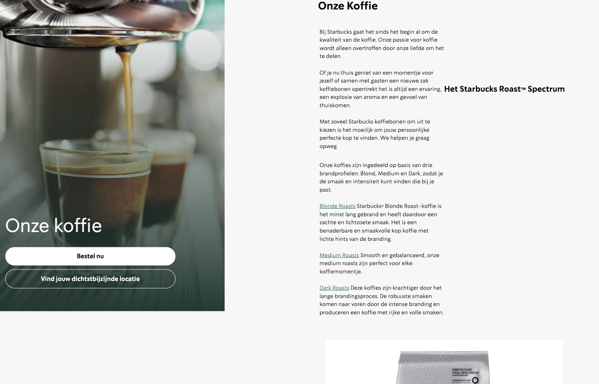
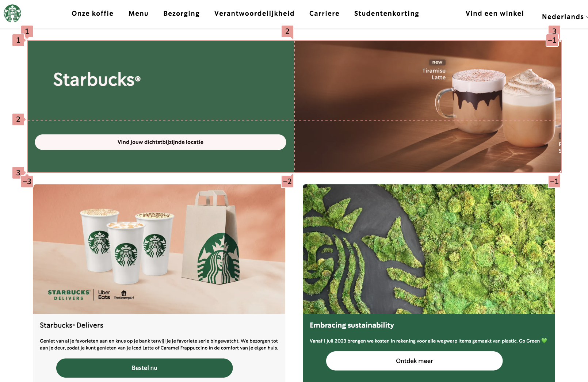
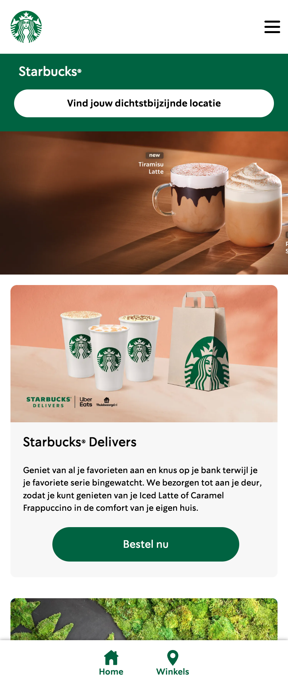
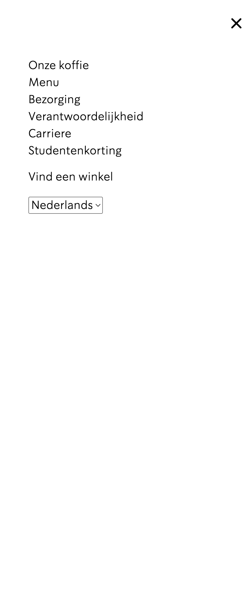
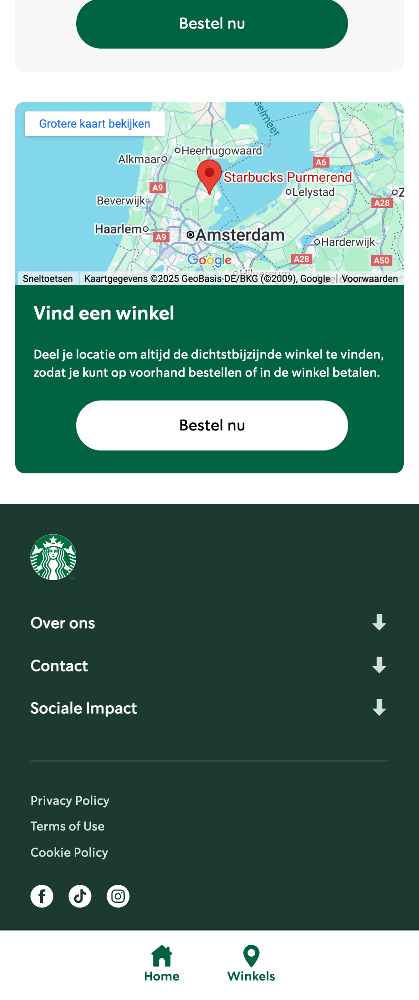

# Procesverslag
Markdown is een simpele manier om HTML te schrijven.  
Markdown cheat cheet: [Hulp bij het schrijven van Markdown](https://github.com/adam-p/markdown-here/wiki/Markdown-Cheatsheet).

Nb. De standaardstructuur en de spartaanse opmaak van de README.md zijn helemaal prima. Het gaat om de inhoud van je procesverslag. Besteedt de tijd voor pracht en praal aan je website.

Nb. Door *open* toe te voegen aan een *details* element kun je deze standaard open zetten. Fijn om dat steeds voor de relevante stuk(ken) te doen.

## Jij

  
uitwerken voor kick-off werkgroep

  ### Auteur:
  Serra Dekker

  #### Je startniveau:
  Blauw

  #### Je focus:
  Responsive
 

## Je website

  
uitwerken voor kick-off werkgroep

Ik ben begonnen met het maken van mijn website voor small screen en heb al een deel van de HTML en Css gemaakt.
  ### Je opdracht:
  https://www.starbucks.nl 
  #### Screenshot(s) van de eerste pagina (small screen): 
Homepage
  

  #### Screenshot(s) van de tweede pagina (small screen):
  hier de naam van de pagina  
  
 

## Toegankelijkheidstest 1/2 (week 1)

  
uitwerken na test in 2e werkgroep

  ### Bevindingen
  Lijst met je bevindingen die in de test naar voren kwamen:
  - De pagina is goed te gebruiken met een screen reader.
  - Weinig tot geen H1 te vinden
  - Geen ondertitelingen/videos

## Breakdownschets (week 1)

  
uitwerken na afloop 3e werkgroep

  ### de hele pagina en dynamisch deel (hamburgermenu): 
  

## Voortgang 1 (week 2)

  
uitwerken voor 1e voortgang

  ### Stand van zaken
  Ik heb een begin gemaakt aan de website. Dit vind ik altijd lastig dus gebruik ik soms een deel van een andere website die ik al eerder heb gemaakt op een klein begin te hebben. Verder gaat het wel oke.

  Gebruikte bronnen:
  https://www.w3schools.com/tags/tag_figure.asp

  ### Agenda voor meeting

Serra : Ik wil graag de opbouw van mijn HTML bespreken en kijken of er nog dingen niet goed zijn. Ook heb ik denk ik hulp nodig met het uitlijnen van de elementen door middel van een grid.
-Groene lijn onder de eerste section gaat niet weg.
-Deel van de padding weghalen lukt niet
Geis: Css bespreken en kijken welke elementen in een Ul horen.
Vince: M'n navigatie perfect namaken en weten welke elementen ik daarvoor nodig heb in mijn css. En gebruik ik de sections goed en klopt de footer sestematisch.

  ### Verslag van meeting
  hier na afloop snel de uitkomsten van de meeting vastleggen

- Delen van mn code moeten in het engels.
- 3 Stylesheets (alegemeen,header,ect) een per pagina
- Section moet altijd een heading H2.
- Footer "a" moeten in een list.
- Nav in de footer
- button in de footer want die links moeten kunnen uitklappen.
- icons halen uit de html van de officiele website.
- sections maken van de 2de.
- main gebruiken voor uitlijnen.
- Voor de verschillende main een eigen css pagina.
- hekje gebruiken voor niet werkende links.
- Classes gebruiken mag wel voor visually hidden/arialabel. liever visually hidden + class, is om een deel extra bij de scren reader op te noemen als het niet gezien hoeft te worden zeg maar.
- display: grid; grid-template-colums: 1fr 1fr 1fr; , gebruiken met grid maken. 

## Voortgang 2 (week 3)

  
uitwerken voor 2e voortgang

  ### Stand van zaken
  Het coderen vind ik heel lastig. Ik ben bezig met het opbouwen van mijn eerste pagina de html en css. Door hulp vragen in de les en meedoen met de docent lukt het mij maar ik kijk wel op tegen het responsive maken voor groot scherm en het gebruiken van javascript.

  ### Agenda voor meeting

Serra : ik wil weten hoe ik m’n 2de navigatie moet maken en heb hulp nodig met m’n hamburgermenu.
Geis : ik wil kijken of mijn html en css een beetje oke is, weten of ik aspect ratio in mijn css mag gebruiken en vragen hoeveel van mijn header ik moet uitwerken en wat de handigste manier is om dat uit te werken.
June :
Vince : Hamburger menu maken

  ### Verslag van meeting
  
  Ik ben geholpen met met maken van mijn 2de navigatie, die was al bijna klaar maar is nu beter. Ook hebben we mijn code bekeken.

## Toegankelijkheidstest 2/2 (week 4)

  
uitwerken na test in 9e werkgroep

  Opzich werkt alles maar ik weet niet of het de bedoeling is dat de buttons worden voorgelezen ipv de kopjes.

  ### Bevindingen
Ik moet beter leren omgaan met screenreader, opzich werkt mijn website er goed mee maar weet ik zelf nog niet precies hoe het werkt. 

## Voortgang 3 (week 4)

  
uitwerken voor 3e voortgang

  ### Stand van zaken
  Ik heb afgelopen week veel aan mijn website gewerkt en heb veel stappen gezet met het afmaken van de pagina's en ga de komende week de puntjes op de i zetten. Ik vind t nog steeds lastig om zelf javascript te bedenken en te gebruiken maar dit gaat wel al een stuk beter dan een week geleden. 

  ### Agenda voor meeting
  
Serra: Met screenreader worden de buttons en niet de kopjes voorgelezen. Ik heb nog hulp nodig met mijn 2de pagina responsive maken.
Geis: mogen h’s op het begin van sections visually hidden zijn? Html van beide paginas nog nachecken dat er geen gekke dingen gebeuren (denk het niet maar je weet maar nooit) (vooral de footer).

  ### Verslag van meeting
  hier na afloop snel de uitkomsten van de meeting vastleggen

  - namen aanpassen van roots
  - 2x onze koffie ? 
  - 2de pagina h2 h3 en h4 aanpassen
  - van color green color brand maken
  - grid pagina 2: main: display: grid; grid-template: 1fr 1fre; gap: 1em;
  section 1: position: sticky 
  - vragen over grid aanpassen in gesprek 
  - visually hidden op select gebruiken
  - control option u pijltjes naar links
  - vragen voor gesprek voorbereiden:
  1. hoe switch je van nederlands naar engels?
  2. over grid aanpassen
  - Footer nog responsive maken.  height 0, media: heigt 100%, button display none

## Eindgesprek (week 5)

  
uitwerken voor eindgesprek

  Na het laatste voortgangsgesprek heb ik dit gedaan:
  - Op de 2de pagina van de website alle h-nummers aangepast zodat het nu wel klopt.
  - De 2de pagina (iets beter) responsive gemaakt, het werkt nog steeds niet zoals ik het had gewild maar is beter dan niet responsive.
  - Errors weggehaald op beide pagina's.
  - Bronnenlijst en read me bijgewerkt. 
  - Namen in root aangepast (ipv --color-green nu --color-brand ).
  - Een Arialabel toegevoegd aan buttons op de home pagina.

  ### Je uitkomst - karakteristiek screenshots:
  

  ### Dit ging goed/Heb ik geleerd: 
  Korte omschrijving met plaatjes

Ik heb geleerd om een semantische wesbite te maken zonder gebruik te maken van divs, classes, id's of articles.

Ik heb geleerd een hamburgermenu te maken dat inklapt en uitklapt wanneer het scherm word geschaald.

Ik heb geleerd een footer te maken dmv details & summary. Daarnaast ook hoe ik google maps in mijn html kan gebruiken en een 2de navigatie onderaan de pagina zoals op de screenshot te zien is.

Verder over het algemeen ben merk ik persoonlijk dat de lessen mij veel hebben geholpen om over het algemeen coderen beter te begrijpen. Het is nog steeds niet iets waar ik later mee verder wil gaan maar ik snap de basis al wel een stuk beter dan voor de start van dit project.

  ### Dit was lastig/Is niet gelukt:
  1. Het responsive maken van de 2de pagina vond ik erg lastig en is deels gelukt.
  2. De styling van het hamburger menu is niet precies hoe het er op de echte website uitziet.
  3. Zorgen dat de Nederlands/Engels knop werkt, volgens mij zijn er 2 manieren om dit te doen maar kosten deze beide veel tijd, ik heb ervoor gekozen om mij op andere dingen te focussen en de pagina's alleen in het nederlands te maken.
  4. De iconen in de 2de navigatie als stroke en als fill maken. Ik heb ze altijd als fill gedaan.
  5. Geen gebruik maken van articles, ik heb 1 article gebruikt op de 2de pagina omdat ik er niet anders uit kwam.

## Bronnenlijst

  
continu bijhouden terwijl je werkt

  1. Aria label / https://developer.mozilla.org/en-US/docs/Web/Accessibility/ARIA/Reference/Attributes/aria-label 
  2. Details Summary / https://developer.mozilla.org/en-US/docs/Web/HTML/Reference/Elements/summary
  3. Dark color scheme / https://css-tricks.com/dark-modes-with-css/
  4. Grid / https://developer.mozilla.org/en-US/docs/Web/CSS/CSS_grid_layout
  5. Flexbox gebruiken / https://css-tricks.com/snippets/css/a-guide-to-flexbox/
  6. Onze Koffies Responsive maken / https://codepen.io/shooft/pen/emJJBgX 
  7. Code met ChatGPT: 
Prompt: "Hoe zorg ik ervoor dat mijn footer als het scherm groter wordt als 700px de footer opengeklapt blijft staan".
Prompt: "Ik wil een gradient in header op 2de pagina, geef mij een kleurcode voor een overlopende groene gradient vanaf onder."
  8. Tip van Demi: Gebruik een article voor de 2de column.

